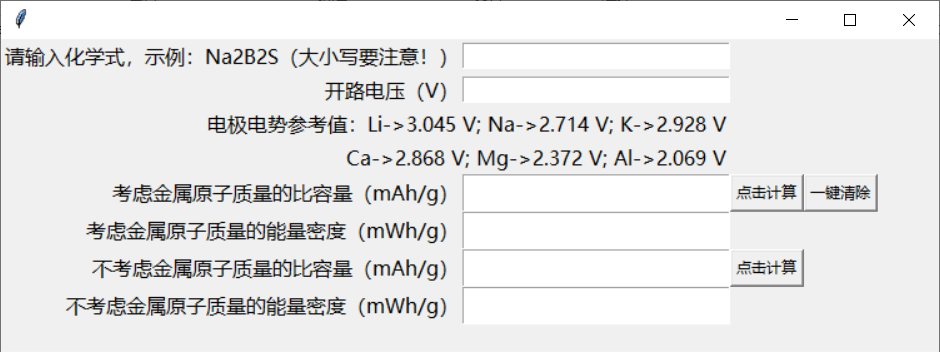

# 计算理论比容量和能量密度

## 1. 使用前须知

所使用的 python 版本 为 3.7

## 2. 使用方法

* 通过 python main.py 运行或直接运行可执行文件
* 在第一栏中输入化学式
* 如果你想要计算能量密度，你可以在第二栏中输入开路电压
* 点击“点击计算”按钮，分别生成考虑金属离子质量和不考虑金属离子质量的结果

**程序界面：**

## 3. 欠缺的地方

* 对于有些地方的错误提示做的不是很好，以后再考虑进行优化
* 另外界面做的其实有点丑了，内容太多，有点乱，以后试一下用 PyQt5 做个界面出来吧