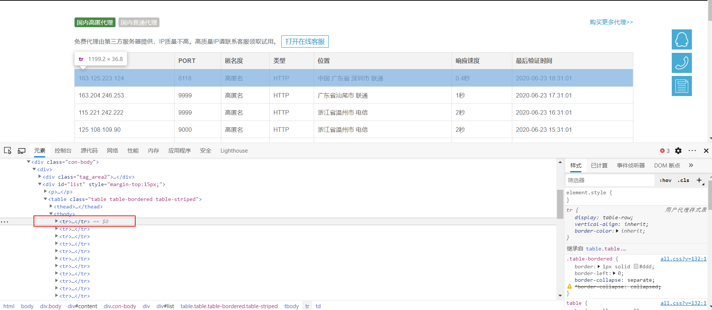

# 爬取过程

1.代理所在网页


2.初始化类

```python
class Proxy(object):
    def __init__(self):
        self.url = "https://www.kuaidaili.com/free/inha/"  # 代理网址
        self.headers = {
            "User-agent": "Mozilla/5.0 (Windows NT 10.0; Win64; x64) AppleWebKit/537.36 (KHTML, like Gecko) Chrome/83.0.4103.106 Safari/537.36 Edg/83.0.478.54",
            "Referer": "https://www.kuaidaili.com/",
            "Host": "www.kuaidaili.com"
        }
        self.all_proxies = []  # 用于存储所爬取到的所有代理
        self.available_proxies = []  # 用于存储有效的代理
        self.available_proxies_queue = Queue()  # 有效的代理队列
```

3.对网页源代码分析得到每条的代理的位置在 table > tbody > tr 下



**写出以下代码爬取这部分内容：**

```python
def get_proxies(self):
        response = requests.get(self.url, headers=self.headers, timeout=5)
        response.raise_for_status()
        html = response.text
        soup = BeautifulSoup(html, "lxml")
        # 选择器语法
        trs = soup.select("table.table.table-bordered.table-striped > tbody tr")
        for each in trs:
            tds = each.select("td")
            ip_address = tds[0].text.strip()
            ip_port = tds[1].text.strip()
            # 代理有 2 种协议，即 http 和 https 协议
            ip_type = "http" if tds[3].text.strip() == "HTTP" else "https"
            proxy = ip_type + "://" + ip_address + ":" + ip_port
            self.all_proxies.append(proxy)
```

4.获取到了代理后，我们需要测试是否有效，这里可以使用访问特定网站的方法，例如：[http://icanhazip.com](http://icanhazip.com)。

**具体代码如下**

```python
def get_available_proxies(self):
        self.get_proxies()
        # 这里创建线程，加快检查代理有效性的速度
        threads = []
        for each in self.all_proxies:
            t = threading.Thread(target=self.check, args=(each, ))
            t.start()
            threads.append(t)
        for t in threads:
            t.join()

        while not self.available_proxies_queue.empty():
            proxy = self.available_proxies_queue.get()	# 从队列中获取代理
            self.available_proxies.append(proxy)

        for each in self.available_proxies:
            self.save_proxies(each)
            
def check(self, proxy):
        proxies = {"https": proxy}
        response = requests.get("http://icanhazip.com", proxies=proxies)
        if response.status_code == 200:
            print("测试成功 -> ", proxy)
            self.available_proxies_queue.put(proxy)
        else:
            print("测试失败 -> ", proxy)
```

5.最后，当然是将爬取到的有效代理保存到本地

**具体代码如下**

```python
def save_proxies(proxy):
    with open(r"proxies.txt", "a", encoding="utf-8") as f:
        f.write(proxy + "\n")
```

6.运行结果


